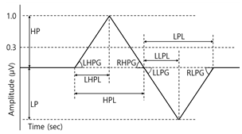

# GanglionManager

[![npm version][npm-image]][npm-url]
[![License][license-image]][license-url]
[![Node.js Version][node-version-image]][node-version-url]

# Installation
```sh
$ npm install ganglion-manager --save

or

$ yarn add ganglion-manager
```

# Example
- fp1, fp2 data 예시
- 개인식별 서비스 등록과 요청은 fp1, fp2 데이터 측정 후 동작 가능
```txt
4.266687244140284,10.3962525751604,25.402068737489852,37.20354036481948,50.21379188368965, ...
```

## 개인식별 서비스 등록
```javascript
const register = require('./Register.js');

var fp1 = fs.readFileSync('fp1 data', 'utf8');  //fp1 뇌파 데이터
var fp2 = fs.readFileSync('fp2 data', 'utf8');  //fp2 뇌파 데이터

register.register(fp1, fp2);
```

## 개인식별 서비스 요청
```javascript
const identification = require('./Identification.js');

var fp1 = fs.readFileSync('fp1 data', 'utf8');  //fp1 뇌파 데이터
var fp2 = fs.readFileSync('fp2 data', 'utf8');  //fp2 뇌파 데이터

var result = identification.identification(fp1, fp2);

if(result)
    console.log("등록된 사용자");
else
    console.log("등록되지 않은 사용자");
```

# 환경 설정
## identificationUp
- 등록한 사용자 token과 식별 요청 token 비교 시 오차 최대 허용 범위인 identificationUp 변경 기능
- 범위 1.0이상의 실수
```javascript
const config = require('./config.js');

config.identificationUp(data);
```

## identificationDown
- 등록한 사용자 token과 식별 요청 token 비교 시 오차 최소 허용 범위인 identificationDown 변경 기능
- 범위 1.0 이하의 실수
```javascript
const config = require('./config.js');

config.identificationDown(data);
```

## minMaxCount
- 개인식별 시 눈 깜빡임 데이터 특징 중 최소값과 최댓값을 제거하여 예외로 두는 과정에서 몇개의 최소값과 최댓값을 제거할 것인지 결정하는 minMaxCount 변경 기능
- 범위 0 이상의 정수
```javascript
const config = require('./config.js');

config.minMaxCount(data);
```

## blinkPoint
- 뇌파 데이터에서 눈 깜박임 발생 시 값이 튀는 것을 감지하는데, 그 경계값인 blinkPoint 변경 기능
- 범위 0 이상의 실수
```javascript
const config = require('./config.js');

config.blinkPoint(data);
```

## delayTime
- 눈 깜빡임 데이터 후 발생하는 잡파를 눈 깜박임 데이터로 감지하지 않기 위해 일정 시간 감지를 중지하는데, 해당 증지 시간인 delayTime 변경 기능
- 범위 0 이상의 정수
```javascript
const config = require('./config.js');

config.delayTime(data);
```

## eogBlink
- 뇌파 데이터 측정 시 잡파가 들어오면 매우 큰 값이 들어와 생체 데이터 수집을 방해한다. 따라서 일정 이상의 값이 들어오면 해당 데이터 수집을 중지 하는데 그 경계값을 나타내는 eogBlink 값 변경 기능
- 범위 0 이상의 정수
```javascript
const config = require('./config.js');

config.eogBlink(data);
```

## count
- 개인식별을 위한 뇌파 데이터 수집 시간 설정값인 count 변경 기능
- 범위 0 이상의 정수, count 1당 약 2초
```javascript
const config = require('./config.js');

config.count(data);
```

# etc.
## 개인식별 원리

- 눈 깜빡임 파형에서 나타나는 10개의 개인식별을 위한 특징과, 개인별 눈 깜빡임 지속 시간, 눈 깜빡임 사이 간격을 이용하여 개인식별


[npm-image]: https://img.shields.io/npm/v/koconut.svg?color=CB0000&label=npm&style=plastic&logo=npm
[npm-url]: https://www.npmjs.com/package/ganglion-manager

[license-image]: https://img.shields.io/github/license/ApexCaptain/GanglionManager.svg?color=E2AC00&label=License&style=plastic&logo=data%3Aimage%2Fpng%3Bbase64%2CiVBORw0KGgoAAAANSUhEUgAAABAAAAAQCAYAAAAf8%2F9hAAAABHNCSVQICAgIfAhkiAAAAAlwSFlzAAAAdgAAAHYBTnsmCAAAABl0RVh0U29mdHdhcmUAd3d3Lmlua3NjYXBlLm9yZ5vuPBoAAAHSSURBVDiNpZLLa1NREMa%2FmXvzaG2lKDW2EdNqi6Ckxq5Kdy0UsnQTs1CrWxcidFPEnYumG%2FFfUHRloC5cBTU%2Bdi6Cr1QUYh9wqS3RWmqoNzf3zrgIN2DahkK%2B1Zw5v%2Flm5nCANkV%2BoC%2BiR6uQayHXeEBJa9N%2BdWKIHO85AGjQmApPWKVm5j%2BDWr5vxv1m3OOIQioE7hZImQEA3CuQP1zPrTOMM95McPLHfQBg32BuYXQxtxMtzOcTyY5pi7SHh7nfs7nfs%2FWwO9QxbdH8ywvJ3E60kFkY%2FeLXmX6wuNYzVdzoHFcJ3QWQC09YpUom9g4Aum6vft%2BLaUyQSl0dhKKUzWYdgqymL6ZPA0DgXC3uN9iPqa%2FgynU1nccAYDtdDz02rtSfmBor7sdQ9U0k%2Fmkpcicx8PO9z35YOZIYOVWew7b5tlY0PwbG7ZvF5d7Zkdjm52bGJJfHzsfKaVWkZYPhrRg4i22IBB0%2BJvVBXB6Ln%2Fx1WRXYxQQ49IgITwGq6V8CSEHdshZm45bf7SDMnqo%2Bi%2F6uZGKvWzHc6vIgatuAmhPV%2FPFLTDwIALKFlG7RkjGgBQAQleXQ5PqTlgZOvq8C4JB%2F9r42PiuU1Ou8YZnNNW3pH9Tv3ULkpzpnAAAAAElFTkSuQmCC
[license-url]: https://github.com/ApexCaptain/GanglionManager/blob/master/LICENSE

[node-version-image]: http://img.shields.io/node/v/ganglion-manager.svg?style=plastic&color=378C37&label=Node.js&logo=node.js
[node-version-url]: https://nodejs.org/download/